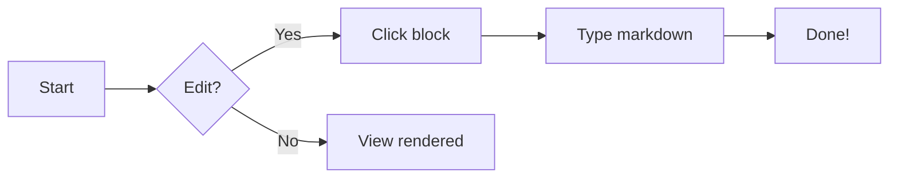

# Welcome to Documents

Documents let you write and share rich content using **Markdown** — a simple text format that renders into beautiful, styled pages.

## Getting started

Click any paragraph, heading or list item below to **edit it in place**. The editor replaces the block with a textarea; click outside it (or press ⌘⏎) to save, or Esc to cancel.

---

## Text formatting

**Bold** and _italic_ text, `inline code`, and ~~strikethrough~~ work naturally.

> Blockquotes help highlight important content. They can span multiple lines.

## Lists

- Bullet lists for unordered items
- Nesting works too
  - Just indent
- [x] Task lists with checkboxes

1. Numbered lists
2. For step-by-step

## Code blocks

```js
function hello(name) {
  return `Hello, ${name}!`;
}
```

## Tables

| Feature | Supported |
|---------|-----------|
| Tables | ✓ |
| Links | ✓ |
| Images | ✓ |

## Mermaid diagrams



## Math (LaTeX)

The quadratic formula: $$x = \frac{-b \pm \sqrt{b^2 - 4ac}}{2a}$$

## Links

- Internal: `[[Note title]]`
- External: [FreeFeed](https://freefeed.net)

---

**That's it!** Click anything above to start editing. Changes stay local until you press **Save**.